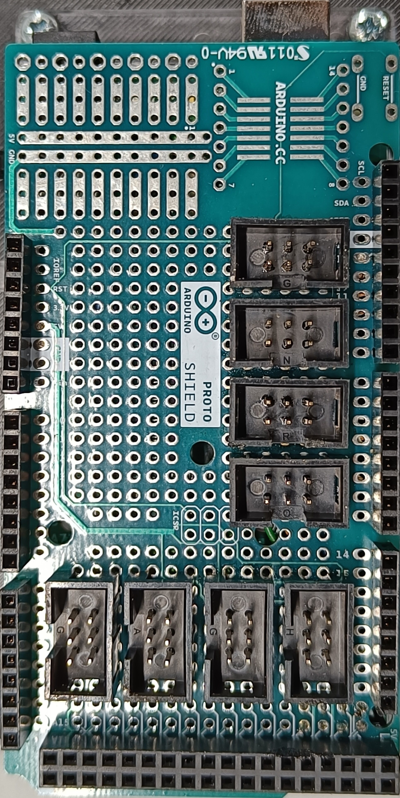
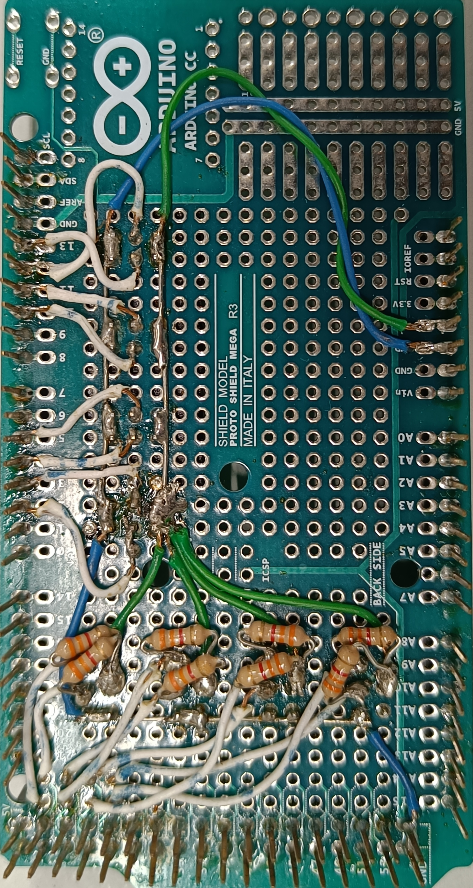

# Electronics of the Revised Hangfa Discovery Q2 Platform

The electronics of the original platform are completely revised in this work.
The original Discovery Q2 has some drawbacks that hinder its usage for robotics
Research & Development (R&D):
- no computing unit to allow the usage of the Robot Operating System (ROS)
  with the robot
- no wheeled odometry data available to the user
- no interface with the original motor drivers board to allow modifications on
  the internal closed-loop speed control of the wheels / linear and angular
  velocity control of the robot
- only a 5V @ 5A DC external output for the user (limiting the possibilities of
  powering multiple sensors such as 2D/3D LiDAR)
- does not support natively 3D LiDAR or RGBD cameras

As a result, this work completely over overhauls the original electronics, only
leaving the Faulhaber 2342 motors present in the Hangfa Discovery Q2.

## Electronics Design

- [Encoders pinout of the Faulhaber 2342 motors](hangfa-discovery-q2_encoders_pinout.pdf)
- Electronics schematic
  ([pdf](schematic.pdf), [easyeda](schematic_easyeda.json))
- [Proto shield connections for the Arduino Mega 2560](arduino-mega-2560_proto-shield_connections.pdf)

## Gallery

**3D framework to host all electronics**

See the 3D model for the electronics framework
([step](/models/v1/electronics_baseplate.step),
[f3d](/models/v1/electronics_baseplate.f3d)) for more information on the 3D
framework's design.

See the [Bill Of Materials (BOM)](/doc/bom.pdf) for more information on the
electronic components considered for the redesign made on the original platform
in this work.

**Arduino Mega Proto Shield**

