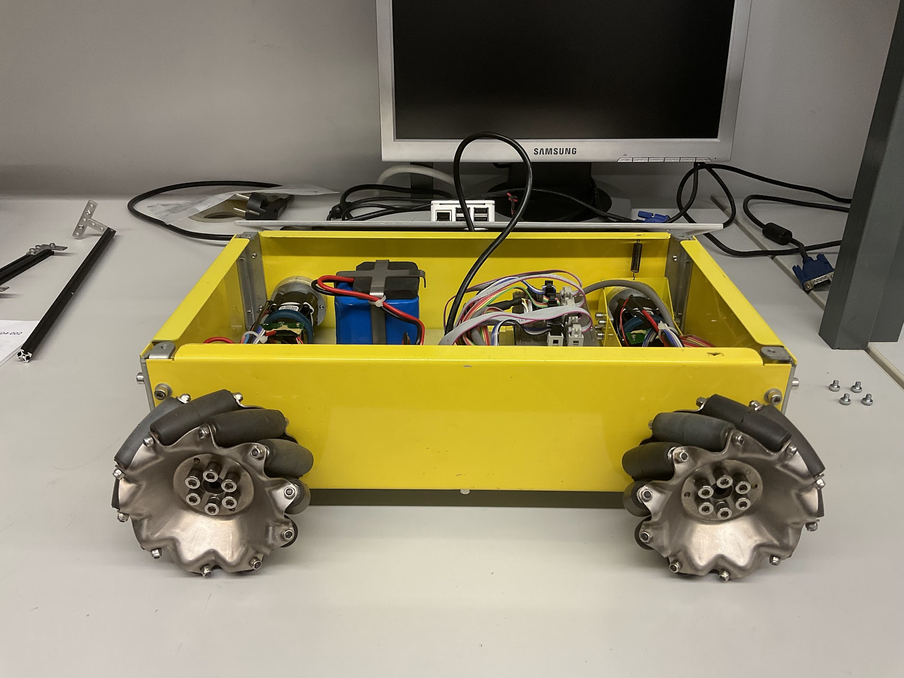

# Hangfa Discovery Q2

The Discovery Q2 is a small robot platform developed by
[HANGFA Robotics](https://www.hangfa-europe.com/).
This platform is a four-wheeled omnidirectional robot with 4 QMA10 mecanum
wheels driven by 4 coreless servo motors, supporting CAN bus and RS232 serial
ports. The original plaform provides a Software Development Kit (SDK), allowing
users to extend the capabilities of the plaform. This SDK provides a complete
communication protocol and source code samples based on the STM32F407.

## Links

- [HANGFA Robotics Europe](https://www.hangfa-europe.com/)
- [Discovery Series](http://www.cdhfyy.com/EN/robot/Discovery.html)
  _(Chengdu HANGFA Hydraulic Engineering Co. Ltd)_
- [Discovery Series](https://www.hangfa-europe.com/en/omni-robot/discovery)
  _(HANGFA Robotics Europe)_
- [Discovery Q2](http://www.cdhfyy.com/EN/robot/DiscoveryQ2.html)
- [QMA Mecanum Wheel Series](http://www.cdhfyy.com/EN/omniwheel/QMA.html)
  _(Chengdu HANGFA Hydraulic Engineering Co. Ltd)_
- [QMA Mecanum Wheel Series](https://www.hangfa-europe.com/en/mecanum-wheels/qma-series)
  _(HANGFA Robotics Europe)_
- [QMA10 Mecanum Wheel](http://www.cdhfyy.com/EN/omniwheel/QMA10.html)

## Documents

- [Hangfa Compass Q2 User Manual](/doc/platform/hangfa-compass-q2_user-manual.pdf)
  (available at https://cdn.robotshop.com/media/h/hfa/rb-hfa-01/pdf/compass_q2_user_manual_1.2.pdf)
- [Hangfa Discovery Q2 Dimensions](/doc/platform/hangfa-discovery-q2_dimensions.pdf)
  (available at http://www.hangfa.com/products/research-platform/discoveryQ2.html)

## Gallery

.jpg)

