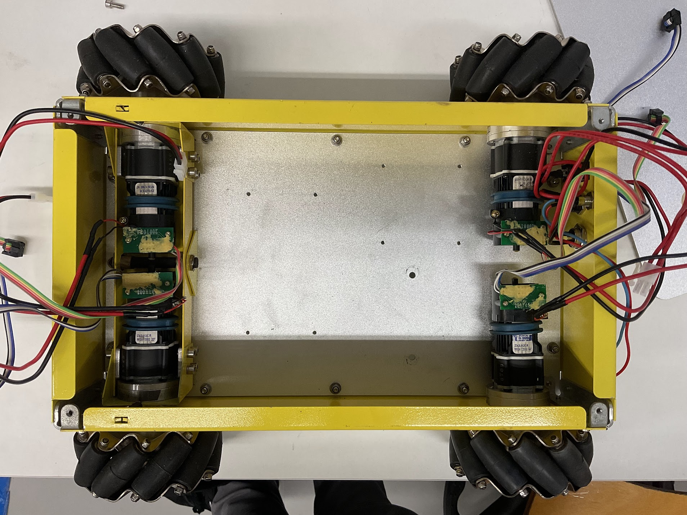
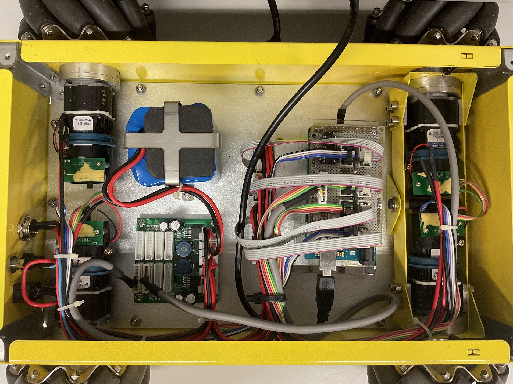
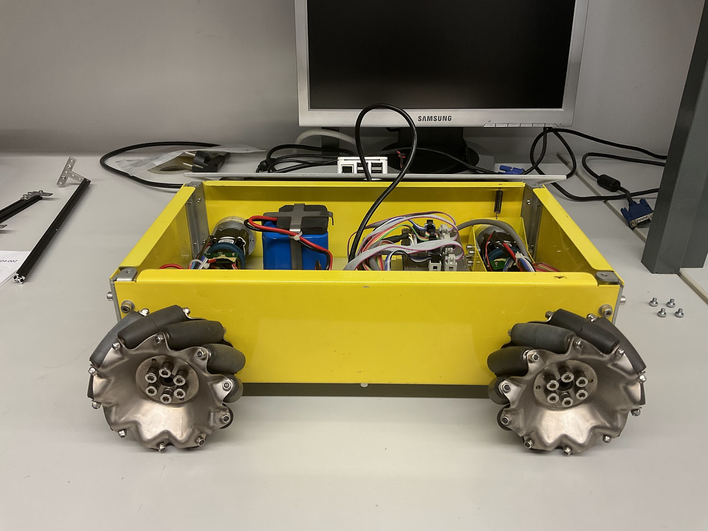

# Hangfa Discovery Q2

The Discovery Q2 is a small robot platform developed by
[HANGFA Robotics](https://www.hangfa-europe.com/).
This platform is a four-wheeled omnidirectional robot with 4 QMA10 mecanum
wheels driven by 4 coreless servo motors, supporting CAN bus and RS232 serial
ports. The original plaform provides a Software Development Kit (SDK), allowing
users to extend the capabilities of the plaform. This SDK provides a complete
communication protocol and source code samples based on the STM32F407.

## Links

- [HANGFA Robotics Europe](https://www.hangfa-europe.com/)
- [Discovery Series](http://www.cdhfyy.com/EN/robot/Discovery.html)
  _(Chengdu HANGFA Hydraulic Engineering Co. Ltd)_
- [Discovery Series](https://www.hangfa-europe.com/en/omni-robot/discovery)
  _(HANGFA Robotics Europe)_
- [Discovery Q2](http://www.cdhfyy.com/EN/robot/DiscoveryQ2.html)
- [QMA Mecanum Wheel Series](http://www.cdhfyy.com/EN/omniwheel/QMA.html)
  _(Chengdu HANGFA Hydraulic Engineering Co. Ltd)_
- [QMA Mecanum Wheel Series](https://www.hangfa-europe.com/en/mecanum-wheels/qma-series)
  _(HANGFA Robotics Europe)_
- [QMA10 Mecanum Wheel](http://www.cdhfyy.com/EN/omniwheel/QMA10.html)

## Documents

- [Hangfa Compass Q2 User Manual](../assets/platform/hangfa-compass-q2_user-manual.pdf)
  (available at https://cdn.robotshop.com/media/h/hfa/rb-hfa-01/pdf/compass_q2_user_manual_1.2.pdf)
- [Hangfa Discovery Q2 Dimensions](../assets/platform/hangfa-discovery-q2_dimensions.pdf)
  (available at http://www.hangfa.com/products/research-platform/discoveryQ2.html)

## Characteristics

| Description                 | Value                                                              |
| :-------------------------- | :----------------------------------------------------------------: |
| Body Structure              | aluminum alloy (bent yellow metal sheets)                          |
| Dimensions                  | 359x313.5x114mm                                                    |
| Weight                      | 7kg                                                                |
| Ground Clearance            | 23mm                                                               |
| Type                        | four-wheeled omnidirectional                                       |
| Maximum Translational Speed | 0.65m/s                                                            |
| Maximum Rotational Speed    | 140º/s                                                             |
| Autonomy                    | >10h @ 3kg load, 0.5m/s, 70% moving rate                           |
| Wheels                      | QMA10 mecanum (Hangfa)                                             |
| Wheels Structure            | carbon steel hub                                                   |
| Wheels Dimensions           | 101.6mm (diameter) x 45.7mm (wide)                                 |
| Wheels Weight               | 350g                                                               |
| Wheels Maximum Load         | 30kg                                                               |
| Wheels #Rollers             | 10                                                                 |
| Wheels Rollers Structure    | two bearings fixation, rubber surface                              |
| Motors Model                | Faulhaber 2342 OEM DC motor                                        |
| Motors Voltage (Rated)      | 12V                                                                |
| Motors Current (Rated)      | 1.1A                                                               |
| Motors Output Power (Rated) | 11W                                                                |
| Motors Speed (Rated)        | 5800rpm                                                            |
| Motors Speed (No-load)      | 6800rpm                                                            |
| Motors Encoders             | 5V, 2 channels, 12CPR                                              |
| Motors Fixation Type        | outer body bearing block bears the wheel in axial and radial loads |
| Motor Drivers               | IMDR4 module boards                                                |
| Motor Drivers Interfaces    | CAN, RS232                                                         |
| Battery                     | 12V DC 10400mAh Li-ion                                             |
| Battery Charger             | KXD-126300 Li-ion charger, 100~240VAC input, 12.6VDC @ 3.0A output |
| External User Power         | 5V @ 5A DC                                                         |
| Electrical Protection       | 10A power fuse                                                     |

## Gallery

.jpg)

.jpg)

## Limitations for Multimodal Perception

- No computer unit included to, e.g., run Robot Operating System (ROS)-based
  executable nodes
- Wheeled odometry data not available
- IMDR4 board does not have an interface to change the internal closed-loop
  control if needed
- Only 5V @ 5A external output provided to the user
- No native support for 3D LiDAR and RGBD cameras
