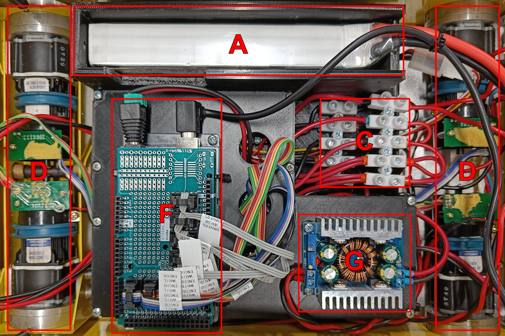
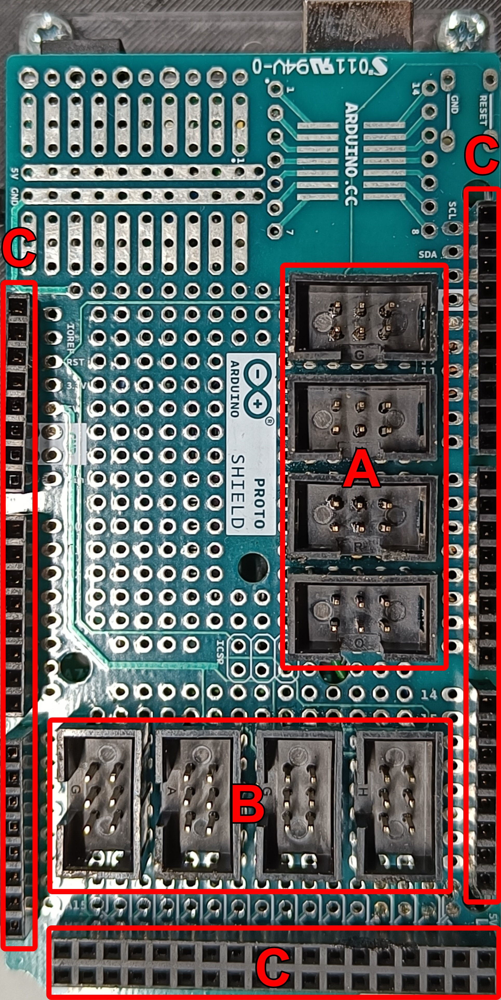
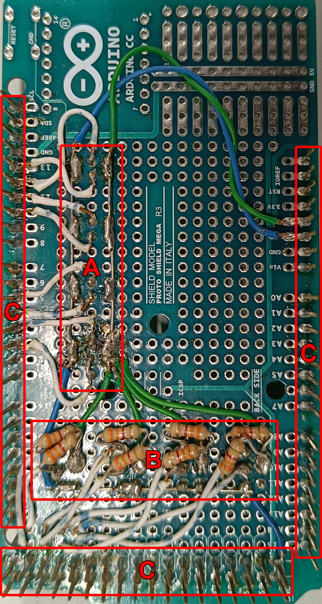

# Assembly

## 3D Electronics Framework

**3D Model**

- [AutoDesk Fusion 360](https://github.com/sousarbarb/inesctec_mrdt_hangfa_discovery_q2/blob/main/models/v1/electronics_baseplate.f3d)
- [STEP](https://github.com/sousarbarb/inesctec_mrdt_hangfa_discovery_q2/blob/main/models/v1/electronics_baseplate.step)

**Legend**

- **A:** Tattu 10000mAh 11.1V 15C 3S LiPo Battery
- **B:** 18650 BMS Charger 3S 12.6V 20A Rev. 2.0
- **C:** voltage and ground electric buses
- **D:** Faulhaber 2342 OEM DC Motors (and optical encoders with 12 CPR)
- **E:** Cytron 13A 5-30V Single DC Motor Driver
- **F:** Arduino Mega 2560 Rev3 + Arduino Mega Proto Shield Rev3 (PCB)
- **G:** DC 5-30V to 1.25-30V 8A Buck Boost Converter

### Base Plate

### First Level

## Arduino Mega Proto Shield

**Documents**

- [Arduino Mega 2560 - Proto Shield Connections](../../assets/electronics/arduino-mega-2560_proto-shield_connections.pdf)
- [Hangfa Discovery Q2 - Encoders Pinout](../../assets/electronics/hangfa-discovery-q2_encoders_pinout.pdf)

**Legend**

- **A:** motor drivers connectors (GND, PWM, direction)
- **B:** encoders connectors (GND, CHA, CHB, Vcc) with 3.3kΩ pull-up resistors
- **C:** Arduino Mega standard headers

### Front View

### Back View

