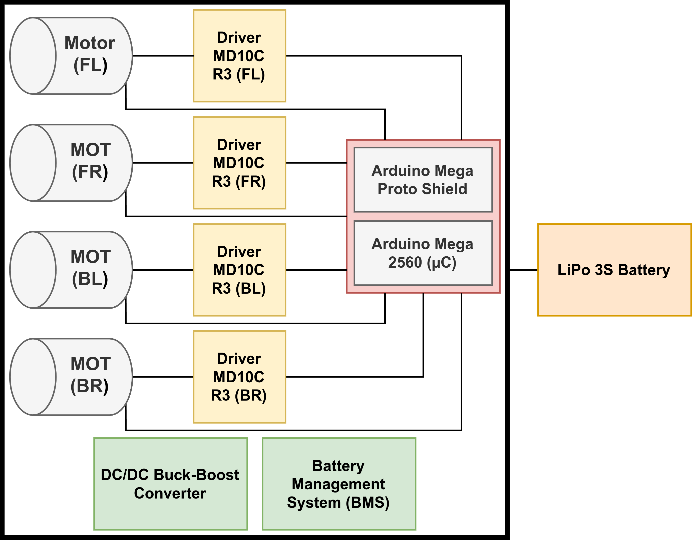

# Electronics

The electronics of the original platform are completely revised in this work.
The original Discovery Q2 has some drawbacks that hinder its usage for robotics
Research & Development (R&D):

- no computing unit to allow the usage of the Robot Operating System (ROS)
  with the robot
- no wheeled odometry data available to the user
- no interface with the original motor drivers board to allow modifications on
  the internal closed-loop speed control of the wheels / linear and angular
  velocity control of the robot
- only a 5V @ 5A DC external output for the user (limiting the possibilities of
  powering multiple sensors such as 2D/3D LiDAR)
- does not support natively 3D LiDAR or RGBD cameras

As a result, this work completely over overhauls the original electronics, only
leaving the Faulhaber 2342 motors present in the original Hangfa Discovery Q2
platform.

## Overview

