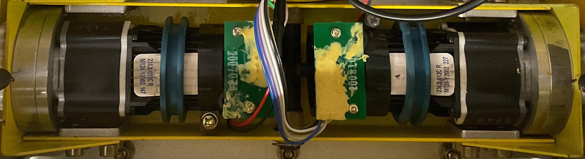
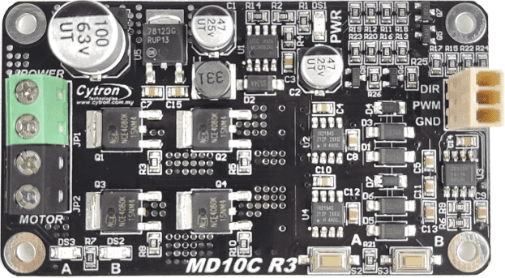

# Motors

| Description          | Value                                                              |
| :------------------- | :----------------------------------------------------------------: |
| Model                | Faulhaber 2342 OEM DC motor                                        |
| Voltage (Rated)      | 12V                                                                |
| Current (Rated)      | 1.1A                                                               |
| Output Power (Rated) | 11W                                                                |
| Speed (Rated)        | 5800rpm                                                            |
| Speed (No-load)      | 6800rpm                                                            |
| Encoders             | 5V, 2 channels, 12CPR                                              |
| Fixation Type        | outer body bearing block bears the wheel in axial and radial loads |

## Drivers

- **Goal:** control the DC motors of the original
  [Hangfa Discovery Q2](https://www.hangfa-europe.com/en/omni-robot/discovery)
  mobile platform
- **Model:** Cytron 13A 5-30V Single DC Motor Driver
- Voltage range 5-30V compatible with the Faulhaber 2342 OEM DC motor (12V)
- Maximum continuous current of 13A and peak motor current of 30A should be
  compatible with the Faulhaber 2342 OEM DC motor (rated at 1.1A, 11W)
- Single PWM signal for speed control with a digital direction pin to set the
  direction of the motor speed
- 3.3V and 5V logic level input compatible with the Arduino Mega 2560
  microcontroller

## Encoders

- **Goal:** 5V, 2 channels, 12CPR encoders present on the Faulhaber 2342 OEM DC
  motors (green PCB board on top of the motors) generate quadrature signals for
  the microcontroller to read the angular speed of the motors
- **Requirement:** upon experimental test, 3.3 kΩ pull-up resistors are soldered
  to the channels A and B inputs of the four encoders on the microcontroller's
  proto shield to reduce signal noise and improve the quadrature between
  channels A and B

!!! Warning

    The cables on the encoders of the original
    [Hangfa Discovery Q2](https://www.hangfa-europe.com/en/omni-robot/discovery)
    mobile platform seem to not be correctly soldered into the encorder's green
    board. This flaw may lead to incorrect encoders reading. As a result, you
    probably are more safe if you resolder all the cables in the encoders.

!!! Tip

    The yellow stuff on the encoder's green board comes out with heat (e.g., use
    a heat gun carefully with the help of a tool to remove the yellow stuff in
    order to be able to resolder the cables).
