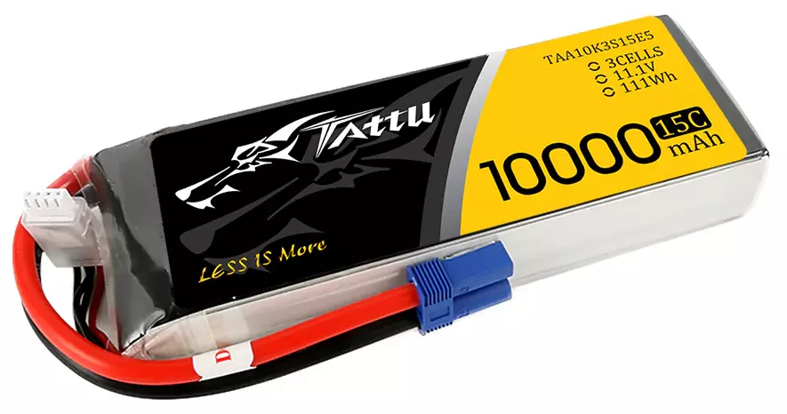
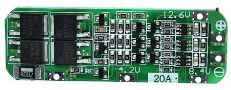
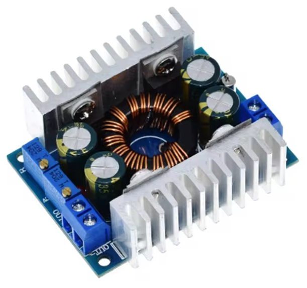
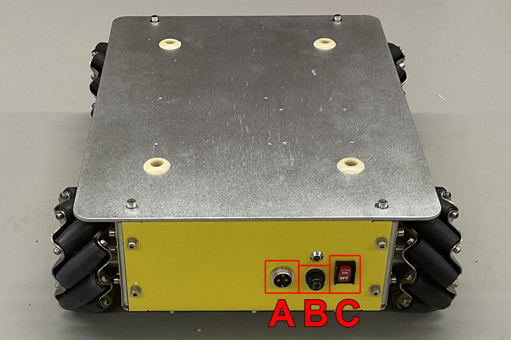
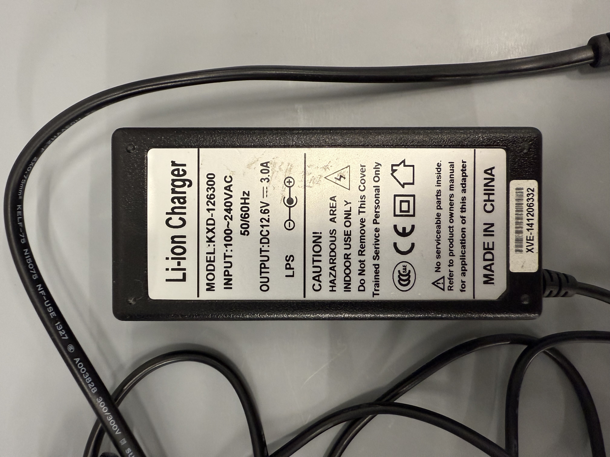

# Power

## Battery

- **Goal:** power all the electronics related to the robot's base platform
  (including motors, motor drivers, external devices of the user that may
  require DC power)
- **Model:** Tattu 10000mAh 11.1V 15C 3S LiPo Battery
- 11.1V makes it compatible to power the Faulhaber 2342 OEM DC motors (12V)
- 11.1V is also compatible to power the Arduino Mega 2560 (7-12V recommended,
  6-20V limit), even though the microcontroller can be powered directly from the
  USB connection

## Battery Management System (BMS)

- **Goal:** balance the voltage of the battery cells both when discharging and
  upon charging
- **Model:** 18650 BMS Charger 3S 12.6V 20A Rev. 2.0
- Compatible with 3S (three cells in series) batteries
- Compatible with the maximum voltage of each LiPo cell (4.2V)

## DC/DC Buck-Boost Converter

- **Goal:** provide a regulated and adjustable DC power output for external
  devices (e.g., Ethernet switch, 3D LiDARs)
- **Model:** DC 5-30V to 1.25-30V 8A Buck Boost Converter
- Input voltage compatible with the output voltage of the LiPo battery
- Output voltage compatible with common voltage values such as 5V / 12V / 24V

## Charging

**Hangfa Discovery Q2**

- **A:** charging connector
- **B:** 20A power fuse for electrical protection
- **C:** ON/OFF switch

### Original Charger

**Model:** KXD-126300 Li-ion charger, 100~240VAC input, 12.6VDC @ 3.0A output

!!! Warning

    The original charger that comes with the platform may not be the
    most suitable for charging the LiPo battery. Even if the charger
    indicator turns green, it does not necessarily mean that charging
    has stopped, which could lead to overcharging and potentially
    swollen batteries.

1. Turn OFF the Discovery Q2 platform
2. Connect the charger to AC power (LED on the charger should turn green)
3. Connect the charger output plug to the Discovery Q2 platform
    - If the LED on the charger turns red, it is charging the platform
    - Otherwise, the battery is fully charged
4. Disconnect the charger from the platform when the battery is fully charged

### LiPo Charger

- **Model:** LiPo Battery Charger LBC-011 (or any other charger specific for
  LiPo batteries)
    - [iMAX B6AC User Manual](../../assets/electronics/battery-charger_imaxb6ac_user-manual.pdf)

1. Turn OFF the Discovery Q2 platform
2. Connect the charger to AC power (charger screen should turn on)
3. Select the **CHARGE** mode (use the buttons
   **:octicons-triangle-left-24: Status :octicons-triangle-right-24:** to
   navigate through the available modes)
4. If the charger is not configure for **LiPo** batteries
    1. Press (just one click!) **Batt. Type** button
    2. Select **PROGRAM SELECT LiPo BATT** (use the buttons
   **:octicons-triangle-left-24: Status :octicons-triangle-right-24:** to
   navigate through the available programs and settings)
    3. Press (just one click!) **Enter**
5. If the charger is not configure for **3.0A 11.1V (3S)** when in
   **CHARGE** mode
    1. Press (just one click!) **Enter** button
    2. Use the buttons
       **:octicons-triangle-left-24: Status :octicons-triangle-right-24:** to
       adjust the charging current to **3.0A**
    3. Press (just one click!) **Enter** button
    4. Use the buttons
       **:octicons-triangle-left-24: Status :octicons-triangle-right-24:** to
       select the **11.1V (3S)** battery configuration
    3. Press (just one click!) **Enter** button
6. Connect the charger output plug to the Discovery Q2 platform
7. Long press on the **Start** button to start the charging
8. Press (just one click!) **Enter** button to confirm the **11.1V (3S)**
   battery configuration
9. Charger should terminate automatically the charging when the battery is fully
   charged
10. Press **Stop** button to stop the charging
11. Disconnect the charger from the platform when the battery is fully charged

See the [User Manual](../../assets/electronics/battery-charger_imaxb6ac_user-manual.pdf)
of the charger for more information on its configurations.

## Power Budget

| Source | Voltage (V) | Current (A) | Power (W) |
| :----- | :-------------------: | :-----------------: | :---------------: |
| 4 x Faulhaber 2342 OEM DC motors | 12V | 4 x 1.1A | 4 x 13.2W |
| 1 x Arduino Mega 2560 | 12V | 0.750A | 9W |
| 1 x Brainboxes SW-005 Ethernet Switch | 5-30V | - | 1.1W |
| 1 x Hokuyo UST-10LX | 10-30V | - | 3.6W @ 24VDC |

**Total Power Budget handled by the LiPo Battery for 2D Autonomous Navigation:**

- **Power Consumption:** 66.5W
  _(very pessimistic estimate, specially for Arduino and the motors)_
- **Current Consumption:** 6A @ 11.1VDC
- **Autonomy:** >> 1h40min

!!! Note

    - Faulhaber 2342 OEM DC motors 1.1A is the nominal current
    - Arduino Mega 2560 current consumption was considered the maximum one
      supported by the SPX1117M3-L-5-0/TR DC Regulator for the PWRIN power input
    - Brainboxes SW-005 Ethernet Switch 1.1W is the maximum power drawn by it
    - Hokuyo UST-10LX current consumption of 0.150A (equivalent to the 3.6W at
      24VDC) is the nominal supply current
