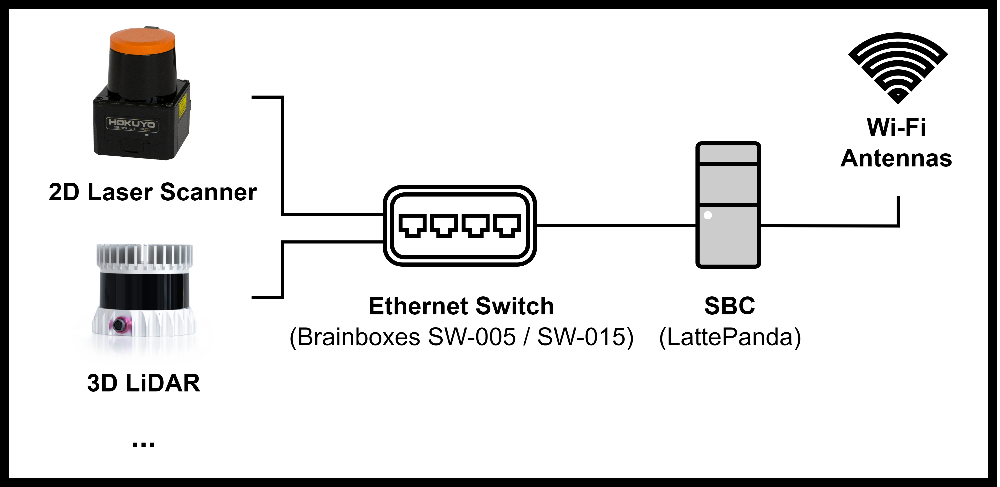
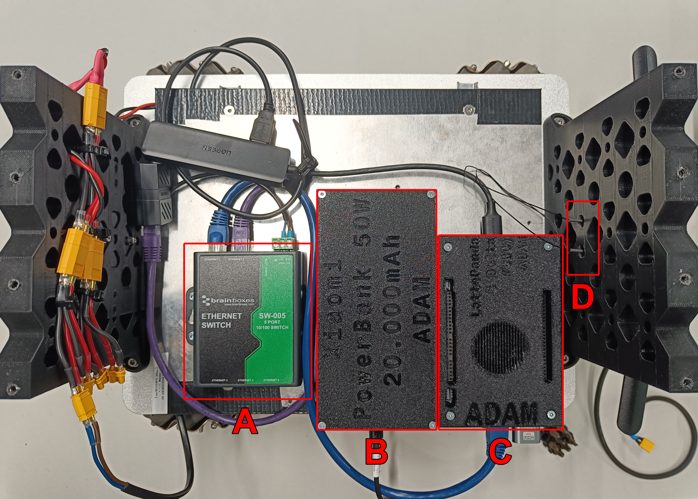

# Network Configuration

The [LattePanda 3 Delta](https://www.lattepanda.com/lattepanda-3-delta) SBC has
only a single Ethernet port. In order to allow multiple sensors that use
Ethernet communicating simultaneously with the SBC, we use an Ethernet switch to
create a Local Access Network (LAN) between the SBC and the sensors (e.g., 2D
laser scanners or 3D LiDARs). Then, the SBC acts as the access point to
local available networks in the deployment site of the mobile platform.
The connection to external networks is through Wi-Fi using the
Bingfu Antena WiFi Dual Band RP-SMA 25cm U.FL IPX IPEX MHF4 M.2 NGFF Intel
to boost the [LattePanda 3 Delta](https://www.lattepanda.com/lattepanda-3-delta)
SBC wireless connectivity.

## Overview

## Ethernet Switch

Given that the network architecture employed in this work does not have a router
on-board the robot, we opted for unmanaged switches due to being plug-and-play
and do not require any configuration. As a result, the Ethernet switch models
considered are from Brainboxes, depending on the desired data transmission speed:

- Brainboxes SW-005
  ([url](https://www.brainboxes.com/product/industrial-ethernet-switches/fast-ethernet/sw-005),
  [datasheet](../assets/networking/ethernet-switch_brainboxes-sw-005_datasheet.pdf))
    - 5 port 10/100Mbps
    - Unregulated +5-30VDC input power
- Brainboxes SW-015
  ([url](https://www.brainboxes.com/product/industrial-ethernet-switches/gigabit-ethernet/sw-015),
  [datasheet](../assets/networking/ethernet-switch_brainboxes-gigabit-switch-range_datasheet.pdf))
    - 5 port 1Gbps
    - Unregulated +5-30VDC input power

## Gallery

- **A:** Brainboxes SW-005 Ethernet Switch
- **B:** Powerbank Xiaomi Mi 50W 20000 mAh
- **C:** LattePanda 3 Delta SBC
- **D:** Bingfu Antena WiFi Dual Band RP-SMA 25cm U.FL IPX IPEX MHF4
  M.2 NGFF Intel
