# Operating System (OS)

## Linux Distributions

The modifield Hangfa Discovery Q2 platform by INESC TEC uses the
[Robot Operating System (ROS)](https://ros.org/) set of software libraries to
facilitate the development of robot-oriented applications. As a result of using
ROS, you should take attention to the compatibility of the Linux distributions
with specific ROS versions. The following list provides a summary on the Linux
compatibility with ROS:

- [ROS 1](https://wiki.ros.org/Distributions)
    - [ROS Noetic Ninjemys](https://wiki.ros.org/noetic) _(EOL: May, 2025)_
        - Ubuntu Focal Fossa 20.04 LTS
          [[amd64]](https://releases.ubuntu.com/focal/)
          [[arm64|armhf]](https://cdimage.ubuntu.com/releases/focal/release/)
        - Debian Buster
          [[amd64|arm64]](https://www.debian.org/releases/buster/)
- [ROS 2](https://docs.ros.org/en/rolling/Releases.html)
    - [ROS 2 Foxy Fitzroy](https://docs.ros.org/en/foxy/) _(EOL: June, 2023)_
        - Ubuntu Focal Fossa 20.04 LTS
          [[amd64]](https://releases.ubuntu.com/focal/)
          [[arm64]](https://cdimage.ubuntu.com/releases/focal/release/)
    - [ROS 2 Humble Hawksbill](https://docs.ros.org/en/humble/) _(EOL: May, 2027)_
        - Ubuntu Jammy Jellyfish 22.04 LTS
          [[amd64]](https://releases.ubuntu.com/jammy/)
          [[arm64]](https://cdimage.ubuntu.com/releases/jammy/release/)
    - [ROS 2 Jazzy Jalisco](https://docs.ros.org/en/jazzy/) _(EOL: May, 2029)_
        - Ubuntu Noble Numbat 24.04 LTS
          [[amd64]](https://releases.ubuntu.com/noble/)
          [[arm64]](https://cdimage.ubuntu.com/releases/noble/release/)

Still, the remaining of the Operating System tutorial will focus on
**Ubuntu Focal Fossa 20.04 LTS** due to its compatibility with both ROS 1 and
ROS 2 versions.

## Create Bootable USB

### Rufus (Windows)

1. Download and install [Rufus](https://rufus.ie/en/)
2. Download the Ubuntu Focal Fossa 20.04 LTS image file
3. Select your :material-usb-flash-drive: USB stick for the Device option
4. Select the :material-ubuntu: Ubuntu image file for the Boot selection option
5. _(optional)_ Disable quick format and/or Enable check device for bad blocks
6. Press the Start button

### Linux

1. Open the Make Startup Disk application
2. Select the :material-ubuntu: Ubuntu image file for the CD-Drive/Image option
3. Select your :material-usb-flash-drive: USB stick for the Device option
4. Make Startup Disk

## Installation

1. :material-power: Power on or reboot the Single Board Computer (SBC)
2. Press **++del++** or **++esc++** key continuously (for LattePanda SBCs) to
   enter into BIOS menu
3. BIOS Setup :material-arrow-right: Boot :material-arrow-right: Select the
   USB drive as the first boot option
4. Save the changes and exit the boot screen
5. Select _Install Ubuntu_
6. Language
    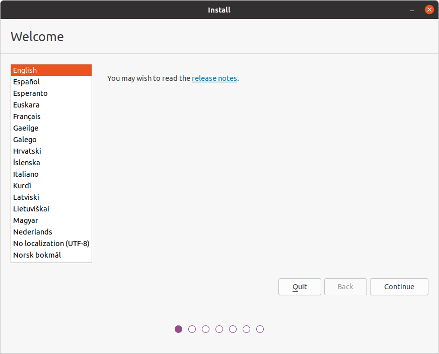
7. Keyboard layout
    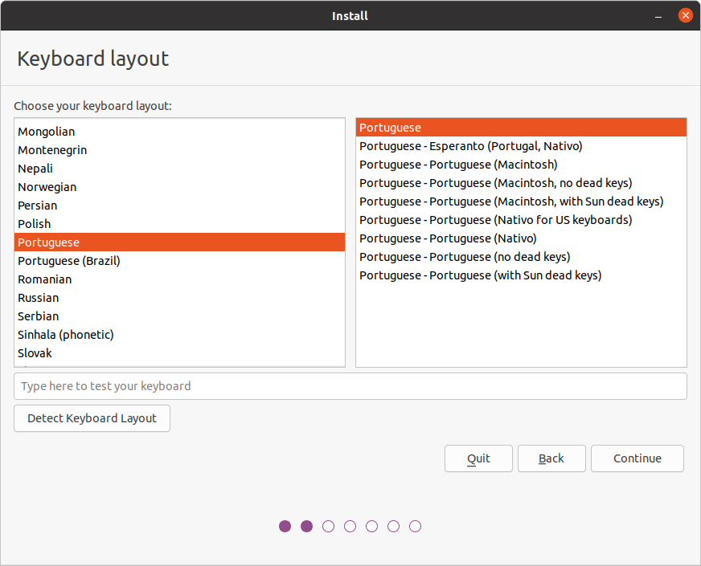
8. Select _Minimal installation_, and enable
   _Download updates while installing Ubuntu_ and
   _Install third-party software for graphics and Wi-Fi hardware_
    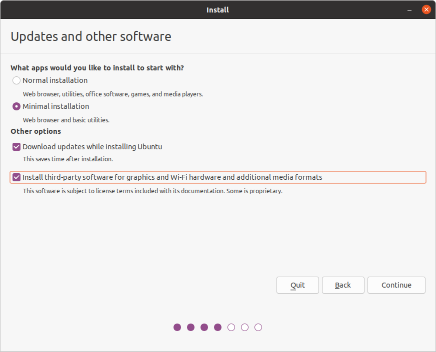
9. Select _Something else_ to create and resize partitions yourselft
    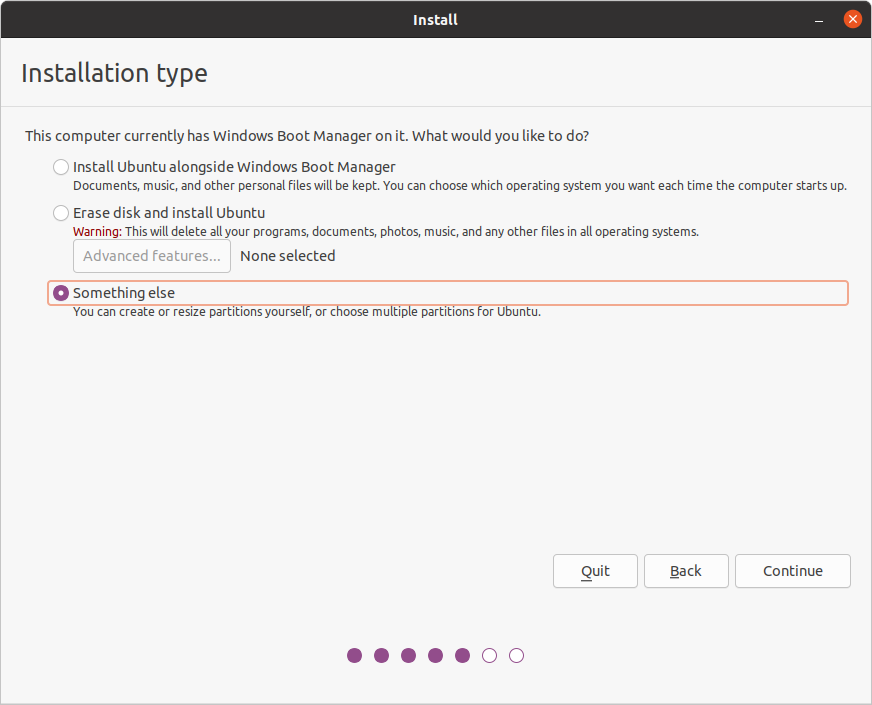
    - Remove all pre-existing partitions
        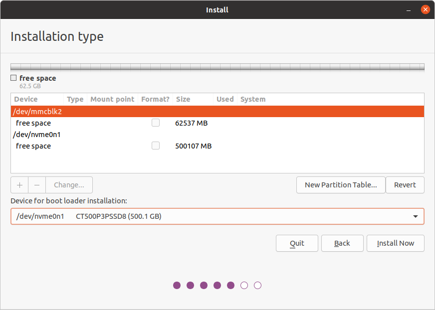
    - SSD (`/dev/nvme0n1`)
        - 512MB EFI System Partition

            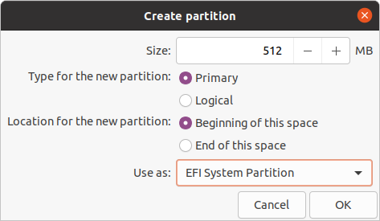

        - 8192MB swap area

            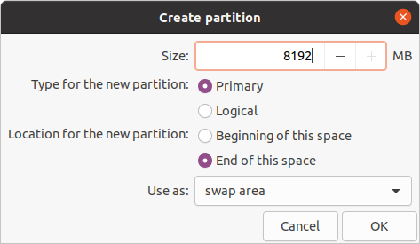

        - `/` root (remaining of the disk free available size)

            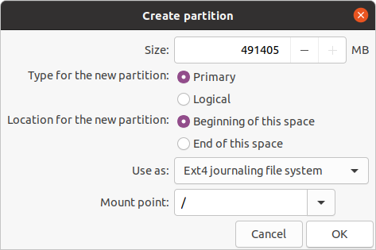

    - eMMC (`/dev/mmcblk2`)
        - `/media/data` partition

            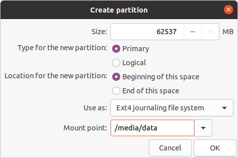

        !!! Tip

            SSD is set as the boot loader and to have the OS's root partition
            due to being faster that eMMC memory. As a result, the latter can be
            used as additional data storage, following the preivous steps.

    - Final partition scheme

        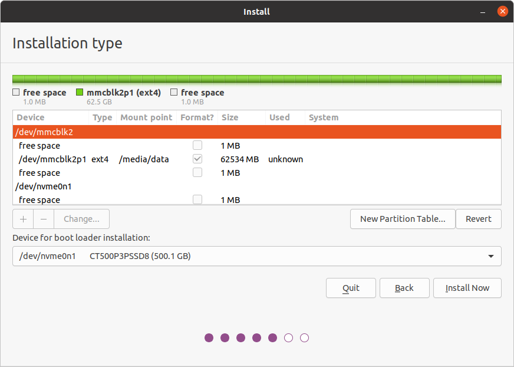

        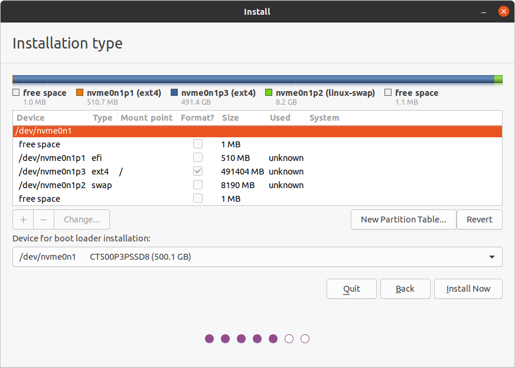

    - Confirm disk changes

        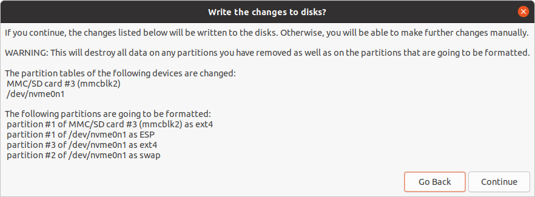

10. Timezone
    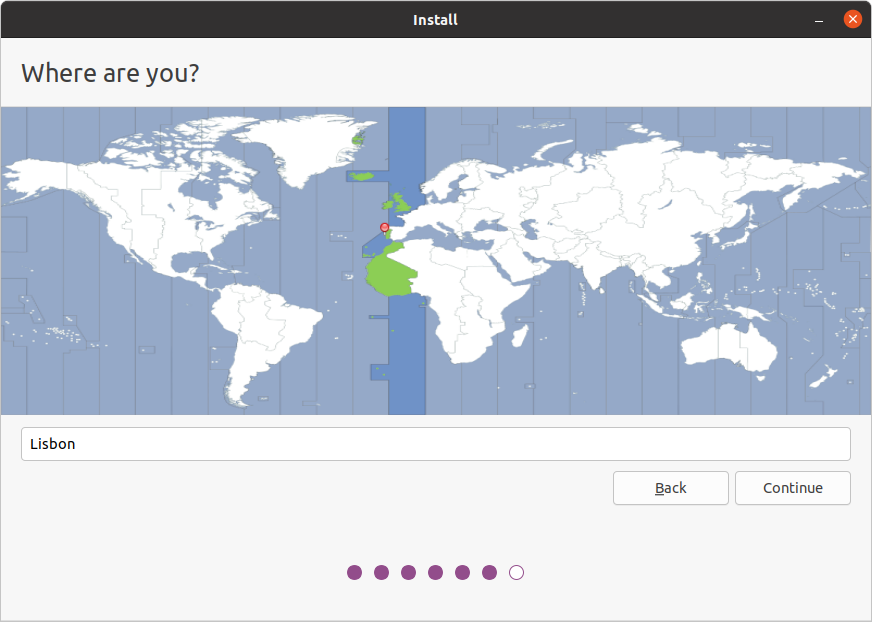
11. User and computer information settings
    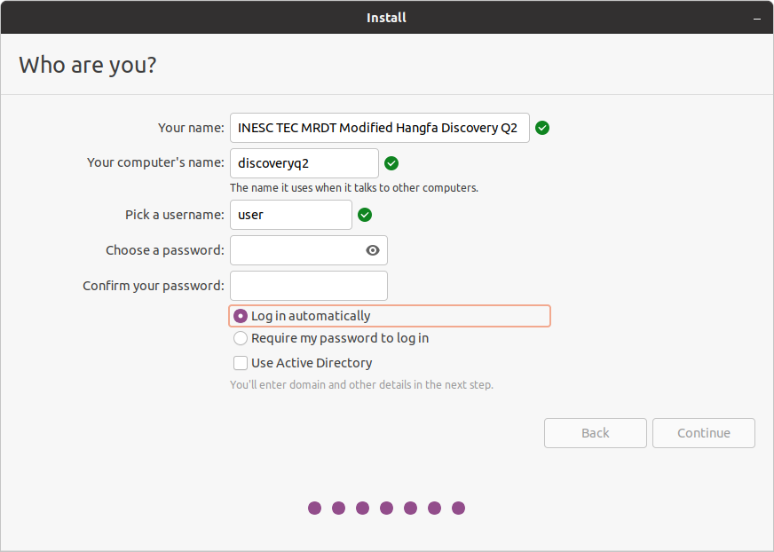

    !!! Warning

        If you have more than 1 robot, it is advisable for you to use different
        computer's name for network discoverability purposes and alias
        definitions.

    !!! Tip

        Use user as the username for all your robots to facilite when connecting
        remotely to the robot
        (e.g., `ssh user@<robot_name>`, assuming that `<robot_name>` is defined
        as a valid network alias).

12. Press _Continue_ to finish the installation of the OS
13. Reboot the Single Board Computer (SBC)

## Getting Started

```sh
sudo apt update
sudo apt dist-upgrade

sudo apt install build-essential git net-tools nmap terminator vim
```
