# 3D Models of the Revised Hangfa Discovery Q2 Platform

This folder presents all the 3D models designed for the revised platform.
These models include a simplified 3D model for the mechanical platform,
a STEP+F3D file for each 3D printed component considered in the
revision, as well as a major STEP+F3D that aglomerates all models into a single
project.

Even though the repository is focused on the v1 version of the overhaul revision
of the platform, there was an initial version ([v0](/models/v0/)) that only
focused on adding a 2D laser scanner and no Single Board Computer (SBC). Indeed,
in that version, we assumed the user would use a laptop for testing the
platform.

## 3D Models

### Front Support for RGBD Cameras

**Requirements**

- Intel RealSense D455/455f/456 (M4, 95mm distance between
  two screws horizontal direction,
  _[intel dev](https://dev.intelrealsense.com/docs/intel-realsense-d400-series-product-family-datasheet)_)
- Intel RealSense L515 (M3, 40mm distance between two screws vertical direction,
  _[intel dev](https://dev.intelrealsense.com/docs/lidar-camera-l515-datasheet)_)
- OAK-D and OAD-D Pro Series (M4, 75mm distance between
  two screws horizontal direction - compatibility with VESA mouting holes,
  _[depthai-hardware](https://github.com/luxonis/depthai-hardware)_)

### Generic Support for 3D LiDARs

**Requirements**

- Livox Mid-360 (M3, 65x65mm, 36x48mm rectangular hole pattern,
  _[mid-360 user manual](https://www.livoxtech.com/mid-360/downloads)_)
- Ouster
  |                          | Holes | Dimensions | Distance between Screws | Description | Source |
  | ------------------------ | :---: | :--------: | :---------------------: | ----------- | :----: |
  | OS0 Rev7 w/ Baseplate    | M8    | 110x110mm  | 80mm | square hole pattern | (_[ouster dev](https://static.ouster.dev/sensor-docs/hw_user_manual/hw_common_sections_OS0/os0-overview.html)_) |
  | OS1 Rev7 w/ Baseplate    | M8    | 110x110mm  | 80mm | square hole pattern | (_[ouster dev](https://static.ouster.dev/sensor-docs/hw_user_manual_OS1/hw_common_sections_OS1/os1-overview.html)_) |
  | OSDome Rev7 w/ Baseplate | M8    | 110x110mm  | 80mm | square hole pattern | (_[ouster dev](https://static.ouster.dev/sensor-docs/hw_user_manual_OSDome/hw_common_sections_OSDome/osdome-overview.html)_) |
- RoboSense Helios Series (M3, 99.8mm diameter, 90mm diameter with a triangular hole pattern
  _[helios series user guide](https://www.robosense.ai/en/resources-81)_)
- Velodyne Puck Series / VLP (1/4''-20, 103mm diameter,
  1 center screw with 2x M4 alignment features separated by 88.9mm,
  _[velodyne puck/vlp](https://ouster.com/downloads/velodyne-downloads)_)

## Gallery

**Revised Hangfa Discovery Q2 Platform**

**Perspective Views from AutoDesk Fusion 360 on the Revised Platform** _(but still orthographic projection...)_

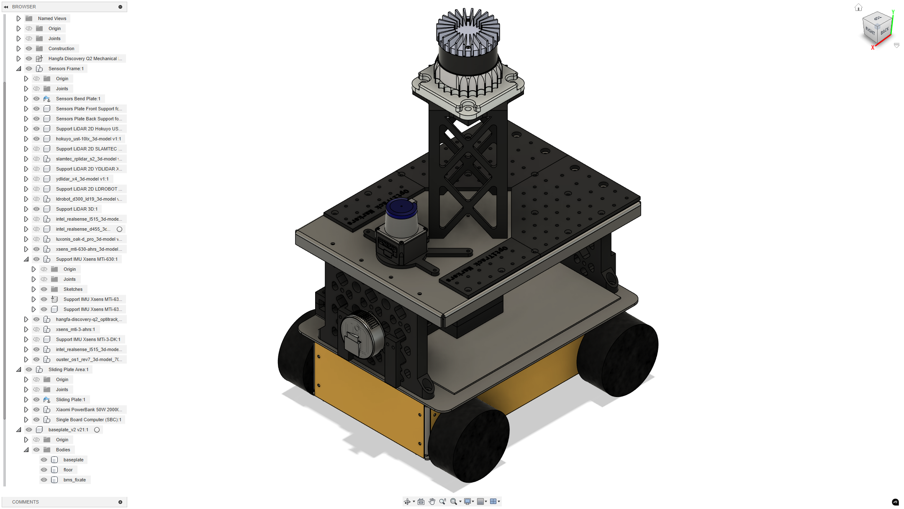

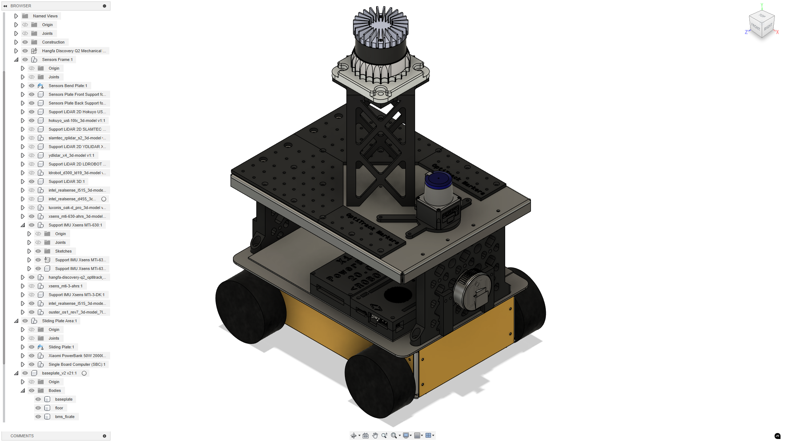

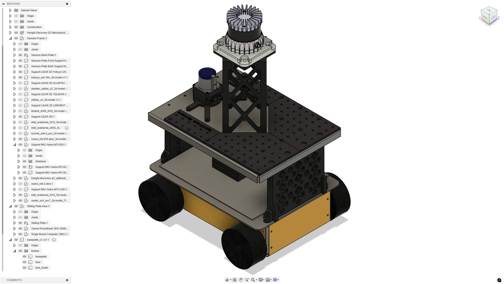

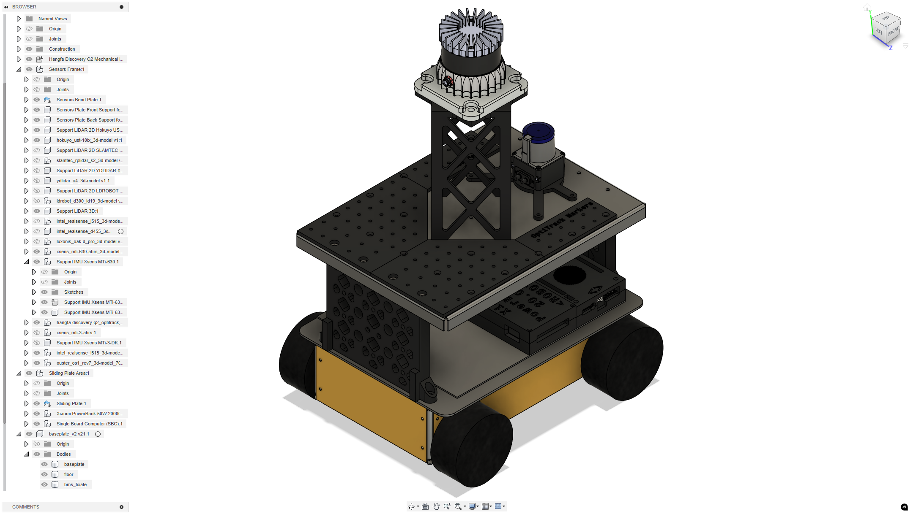

**Ortographic Views from AutoDesk Fusion 360 on the Revised Platform**

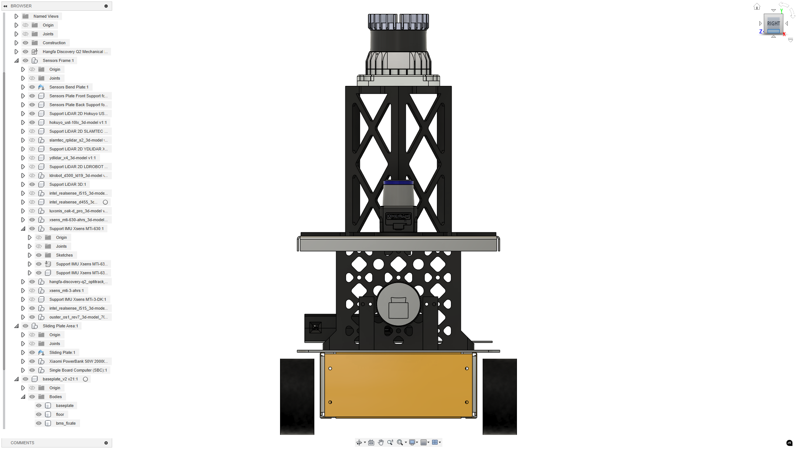

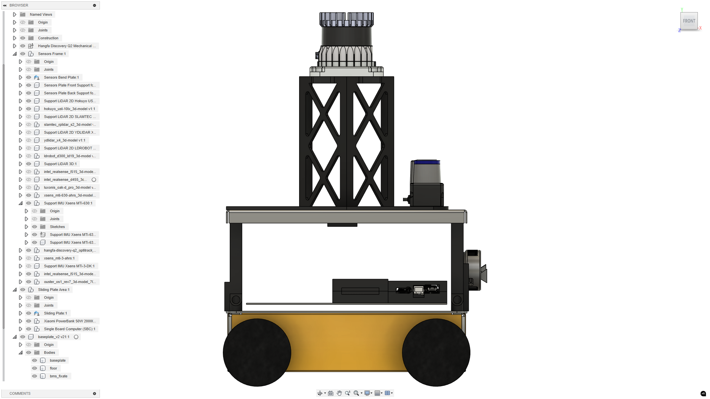

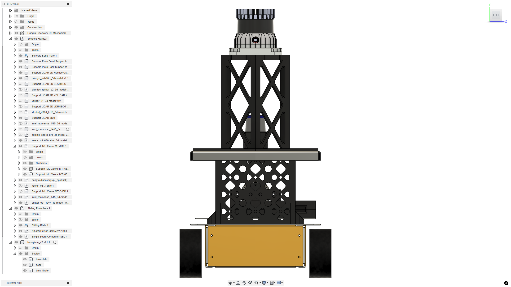

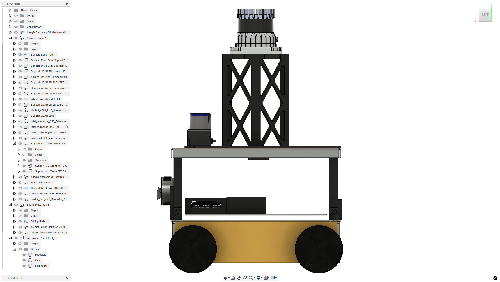

**Miscellaneous...**

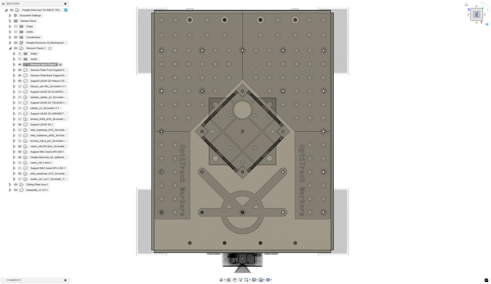

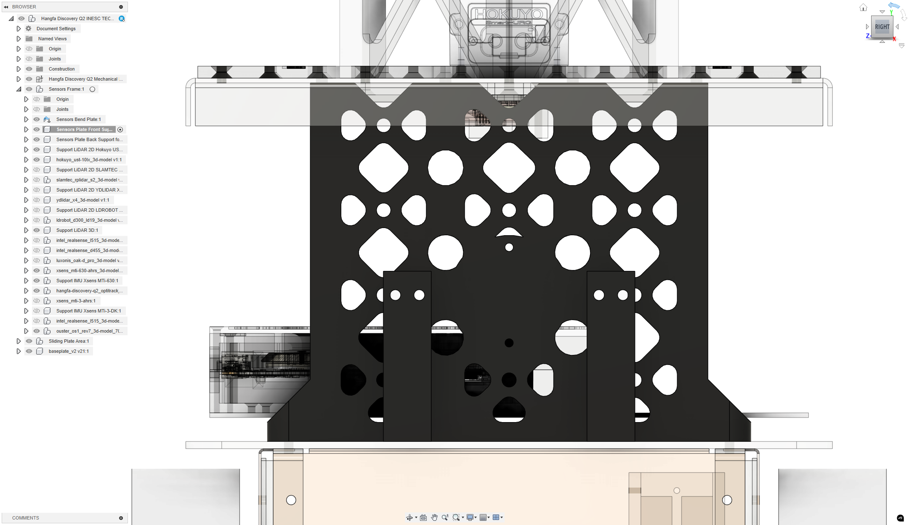

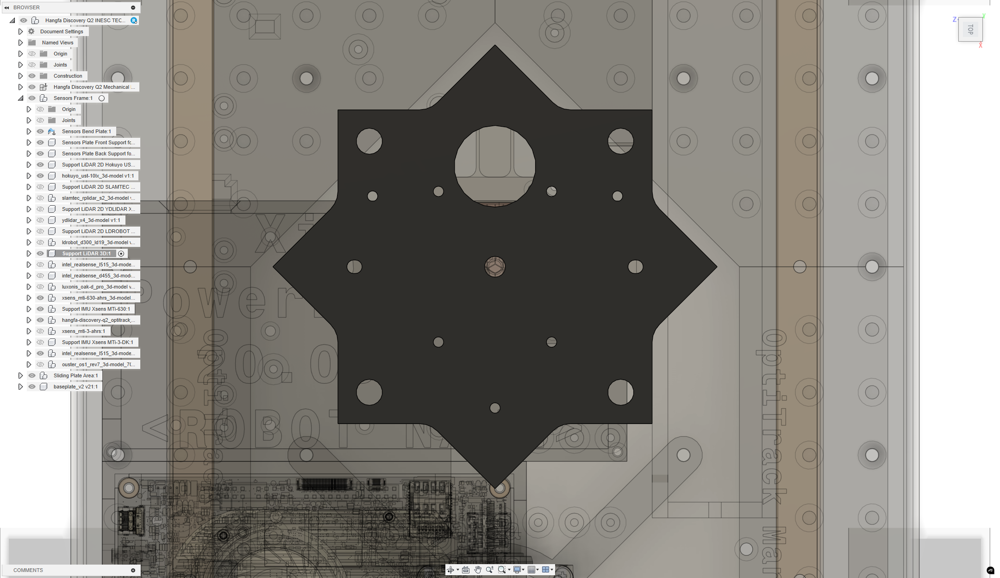

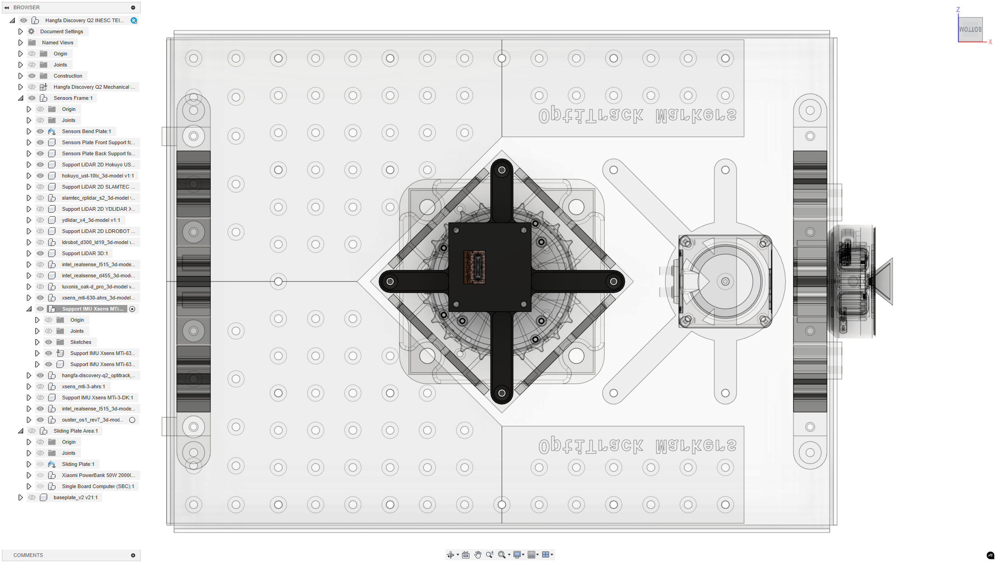

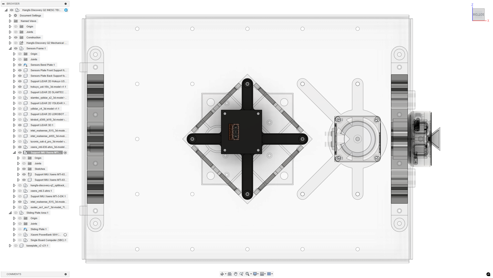
